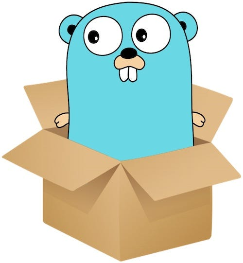

# Golang Sandbox 

Este repositório é um sandbox para projetos e estudos em Golang. 

## Organização da Sandbox 

> Dos mais atuais aos mais antigos

### Projetos de estudo:

#### Geral

- [roller-dice](./projects/general/roller-dice/): Uma API simples em Go para rolar dados de RPG
- [go-server-ip](./projects/general/go-server-ip): Um servidor simples em Go que retorna o endereço de IP do cliente.
- [To-do list](./projects/general/to-do-list): To-do list
- [web-service-gin](./projects/general/web-service-gin/): Api básica com gin 

#### Blockchain

- **Básico**
    - [Blockchain Básica](./projects/blockchain//basic-blockchain-go/)
    - [Cli Wallet](./projects/blockchain/wallet-cli/)
    - [Blockchain Básica com Validador de Bloco](./projects/blockchain/basic-blockchain-with-auditor/)

#### Autor 👷

[Adriano P Araujo](https://www.linkedin.com/in/araujocode/)